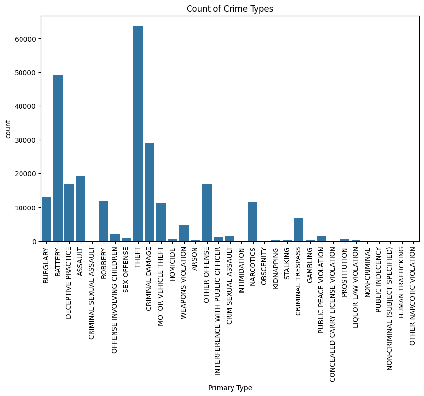
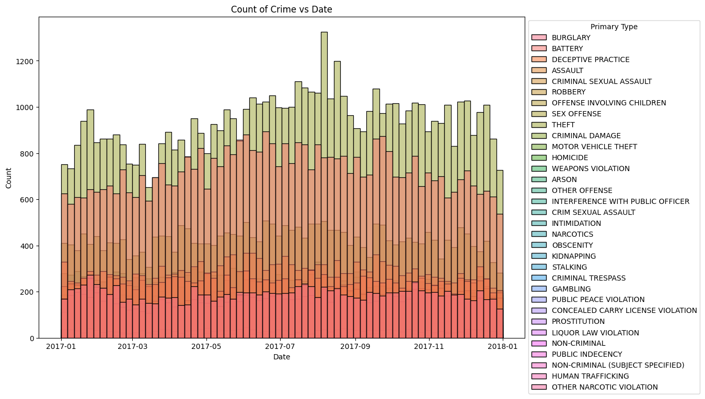

```python
import seaborn as sns
import matplotlib.pyplot as plt
#create seaborn countplot
plt.figure(figsize=(10, 6))
my_plot = sns.countplot(data=dataFrame, x='Primary Type')

#rotate x-axis labels
my_plot.set_xticklabels(my_plot.get_xticklabels(), rotation=90)
plt.title('Count of Crime Types')
plt.show()
```

    C:\Users\Akshay\AppData\Local\Temp\ipykernel_26740\1212175330.py:8: UserWarning: set_ticklabels() should only be used with a fixed number of ticks, i.e. after set_ticks() or using a FixedLocator.
      my_plot.set_xticklabels(my_plot.get_xticklabels(), rotation=90)
    


    

```python

# Set custom color palette
custom_palette = "Set2"
# Define custom color palette
# custom_colors = ["#FF5733", "#33FF57", "#3366FF", "#FF33F3", "#33FFFF", "#FFFF33"]

# Set figure size
plt.figure(figsize=(12, 8))
ax = sns.histplot(dataFrame, x="Date", hue="Primary Type")
plt.title('Count of Crime vs Date')
sns.move_legend(ax, "upper left", bbox_to_anchor=(1,1))
plt.show()
```


    

