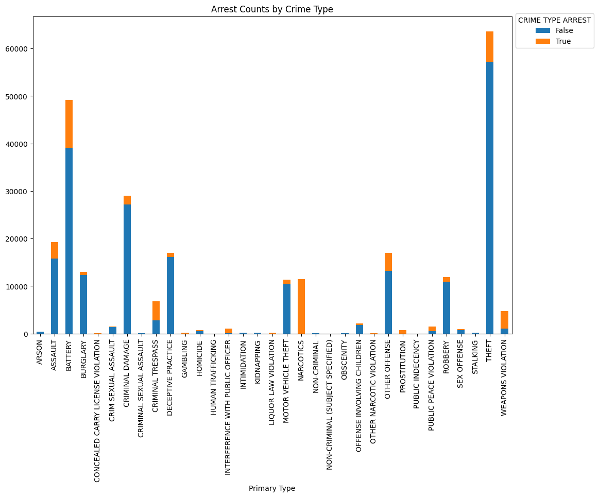
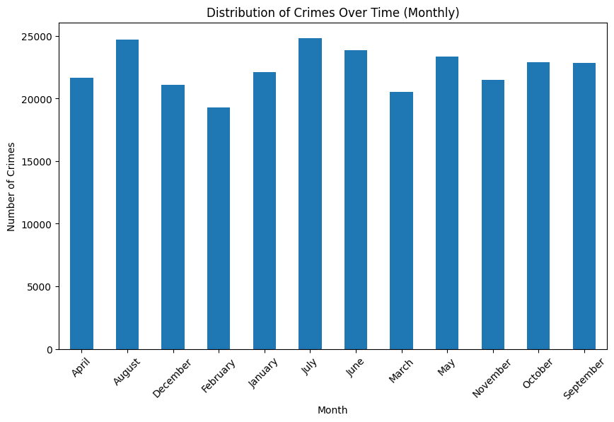
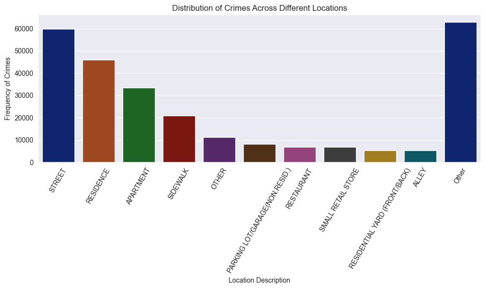
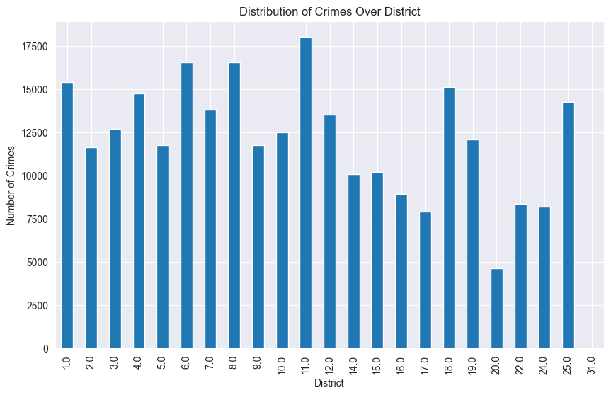
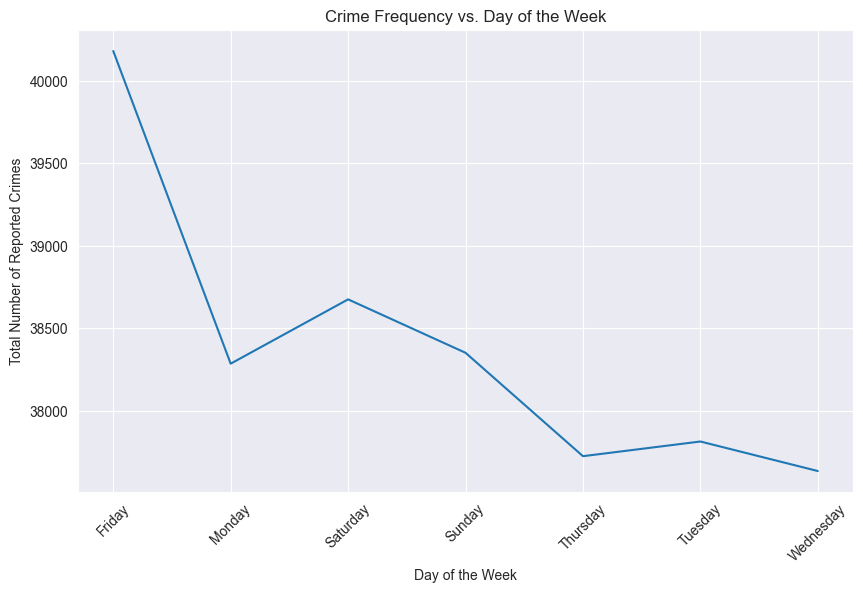
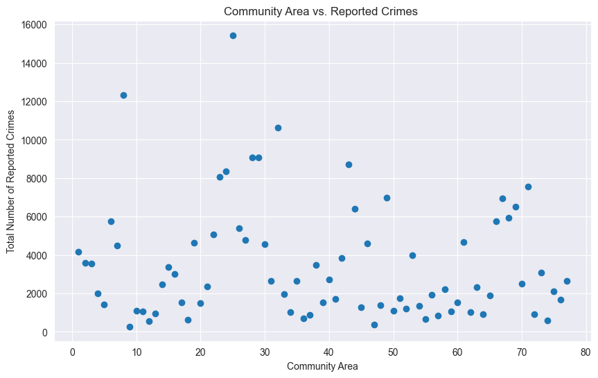
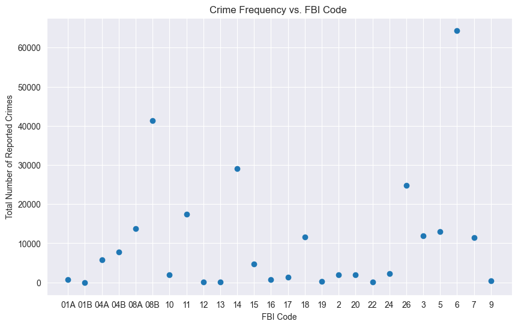
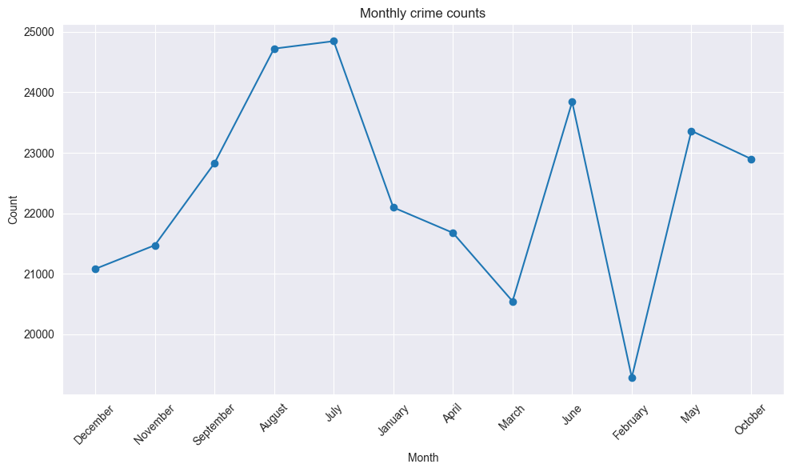
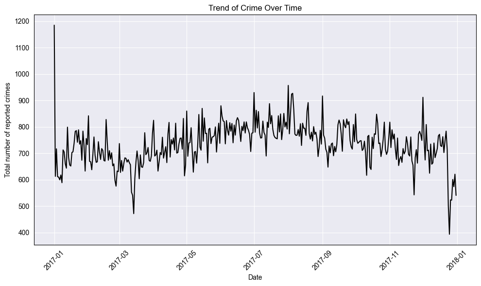

```python
import seaborn as sns
import matplotlib.pyplot as plt
#create seaborn countplot
plt.figure(figsize=(10, 6))
my_plot = sns.countplot(data=dataFrame, x='Primary Type')

#rotate x-axis labels
my_plot.set_xticklabels(my_plot.get_xticklabels(), rotation=90)
plt.title('Count of Crime Types')
plt.show()
```

    C:\Users\Akshay\AppData\Local\Temp\ipykernel_26740\1212175330.py:8: UserWarning: set_ticklabels() should only be used with a fixed number of ticks, i.e. after set_ticks() or using a FixedLocator.
      my_plot.set_xticklabels(my_plot.get_xticklabels(), rotation=90)
    


    

```python

# Set custom color palette
custom_palette = "Set2"
# Define custom color palette
# custom_colors = ["#FF5733", "#33FF57", "#3366FF", "#FF33F3", "#33FFFF", "#FFFF33"]

# Set figure size
plt.figure(figsize=(12, 8))
ax = sns.histplot(dataFrame, x="Date", hue="Primary Type")
plt.title('Count of Crime vs Date')
sns.move_legend(ax, "upper left", bbox_to_anchor=(1,1))
plt.show()
```


    


```python
# Creating bar plot with a bigger size
crosstb = pd.crosstab(dataFrame["Primary Type"], dataFrame["Arrest"])
pl = crosstb.plot(kind="bar", stacked=True, rot=90, figsize=(12, 8))# Creating barplot
# pl = crosstb.plot(kind="bar", stacked=True, rot=90)
# Adding legend and adjusting its position
pl.legend(title='CRIME TYPE ARREST', bbox_to_anchor=(1, 1.02), loc='upper left')
plt.title('Arrest Counts by Crime Type')
# Show the plot
plt.show()
```


    

    


```python
# Load the data and parse the "Date" column as datetime
dataFrame = pd.read_csv("./chicago_crimes_2017.csv", parse_dates=["Date"])

# Extract the month and year information
dataFrame['Month'] = dataFrame['Date'].dt.strftime('%B')
dataFrame['Year'] = dataFrame['Date'].dt.year

# Aggregate the data by month
monthly_crime_count = dataFrame.groupby('Month').size()

# Plot the bar graph
plt.figure(figsize=(10, 6))  # Adjust the figure size as needed
monthly_crime_count.plot(kind='bar', rot=45)
plt.xlabel('Month')
plt.ylabel('Number of Crimes')
plt.title('Distribution of Crimes Over Time (Monthly)')
plt.show()
```



```python
# Set Seaborn dark grid style
sns.set_style("darkgrid")

# Count the frequency of each location description
location_counts = dataFrame['Location Description'].value_counts()

# Select the top 10 most frequent locations
top_locations = location_counts.head(10)

# Group the remaining locations into an "Other" category
other_count = location_counts.iloc[10:].sum()
top_locations['Other'] = other_count

# Create a bar graph to visualize the distribution of crimes across different locations
plt.figure(figsize=(10, 6))
sns.barplot(x=top_locations.index, y=top_locations.values, palette="dark")
plt.xlabel('Location Description')
plt.ylabel('Frequency of Crimes')
plt.title('Distribution of Crimes Across Different Locations')
plt.xticks(rotation=60)  # Rotate x-axis labels for better readability
plt.tight_layout()  # Adjust layout to prevent clipping of labels
plt.show()

```



```python
# Aggregate the data by location
district_crime_count = dataFrame.groupby('District').size()

# Plot the bar graph
plt.figure(figsize=(10, 6))  # Adjust the figure size as needed
district_crime_count.plot(kind='bar', rot=90)
plt.xlabel('District')
plt.ylabel('Number of Crimes')
plt.title('Distribution of Crimes Over District')
plt.show()
```


    



```python
import matplotlib.pyplot as plt

plt.figure(figsize=(10, 6))
plt.plot(crime_frequency_by_day['Day'], crime_frequency_by_day['Crime Frequency'])
plt.xlabel('Day of the Week')
plt.ylabel('Total Number of Reported Crimes')
plt.title('Crime Frequency vs. Day of the Week')
plt.xticks(rotation=45)  # Rotate the x-axis labels for better readability
plt.show()

```


    



```python
# ................color............
plt.figure(figsize=(10, 6))
plt.scatter(crime_frequency_by_community_area['Community Area'], crime_frequency_by_community_area['Community Area wise Crime Frequency'])
plt.xlabel('Community Area')
plt.ylabel('Total Number of Reported Crimes')
plt.title('Community Area vs. Reported Crimes ')
plt.xticks(rotation=0)  # Rotate the x-axis labels for better readability
plt.show()

```


    



```python
crime_frequency_by_FBI_code = dataFrame.groupby('FBI Code').size().reset_index(name='FBI Code wise Crime Frequency')
# crime_frequency_by_FBI_code
```


```python
plt.figure(figsize=(10, 6))
plt.scatter(crime_frequency_by_FBI_code['FBI Code'], crime_frequency_by_FBI_code['FBI Code wise Crime Frequency'])
plt.xlabel('FBI Code')
plt.ylabel('Total Number of Reported Crimes')
plt.title('Crime Frequency vs. FBI Code ')
plt.xticks(rotation=0)  # Rotate the x-axis labels for better readability
plt.show()

```


    



```python
monthly_crime_counts = {}
for month in list(dataFrame["Month"]):
    if month in monthly_crime_counts:
        monthly_crime_counts[month] += 1
    else:
        monthly_crime_counts[month] = 1
months = list(monthly_crime_counts.keys())
counts = list(monthly_crime_counts.values())
# Plotting
plt.figure(figsize=(10, 6))
plt.plot(months, counts, marker='o', linestyle='-')

# Adding title and labels
plt.title('Monthly crime counts')
plt.xlabel('Month')
plt.ylabel('Count')

# Rotating x-axis labels for better readability
plt.xticks(rotation=45)

# Displaying the plot
plt.grid(True)
plt.tight_layout()
plt.show()
```


    



```python
# Aggregate the data by date and count the number of crimes for each date
crime_by_date = dataFrame.groupby(dataFrame['Date'].dt.date).size().reset_index(name='Count')

# Step 2: Plot the Data
plt.figure(figsize=(10, 6))  # Set the figure size
plt.plot(crime_by_date['Date'], crime_by_date['Count'],  linestyle='-', color='black')  # Set the color to black
plt.title('Trend of Crime Over Time', color='black')  # Set the title color
plt.xlabel('Date', color='black')  # Set the x-axis label color
plt.ylabel('Total number of reported crimes', color='black')  # Set the y-axis label color
plt.grid(True)
plt.xticks(rotation=45, color='black')  # Rotate x-axis labels for better readability and set the color
plt.yticks(color='black')  # Set the color of y-axis ticks
plt.tight_layout()
plt.gca().spines['top'].set_color('black')  # Set the color of the top spine
plt.gca().spines['right'].set_color('black')  # Set the color of the right spine
plt.gca().spines['bottom'].set_color('black')  # Set the color of the bottom spine
plt.gca().spines['left'].set_color('black')  # Set the color of the left spine
plt.show()
```


    



